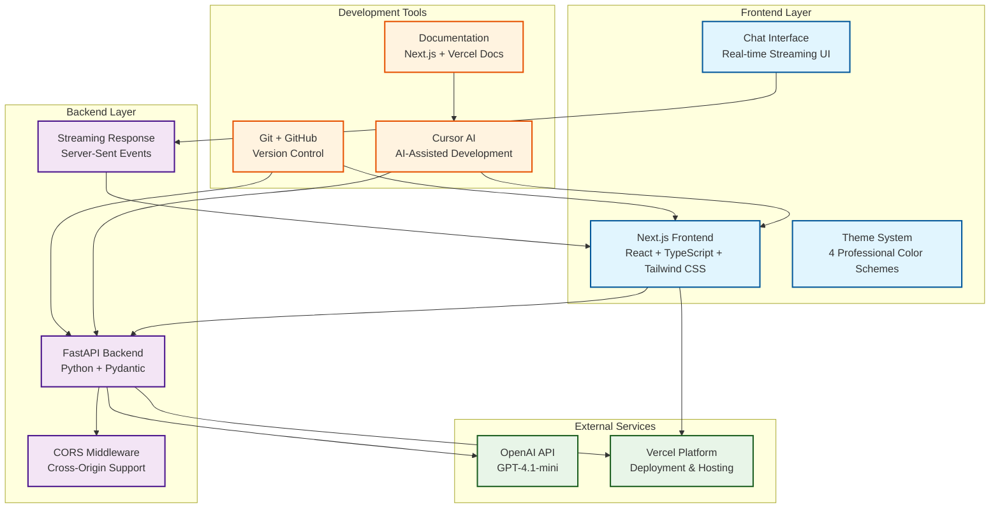

<p align="center" draggable="false">
  
</p>

# 🚀 The AI Engineer Challenge

> **A comprehensive learning platform for building production-ready LLM-powered applications with modern web technologies**

## 🎯 Overview

The AI Engineer Challenge is a hands-on learning experience designed to take you from zero to deploying your first Large Language Model (LLM) powered application. This project combines the power of **FastAPI**, **Next.js**, **OpenAI's GPT models**, and **Vercel** to create a full-stack chat application with real-time streaming responses.

## ⚠️ Production Readiness Note

**This is a learning prototype, not a production-ready application.** While functional for educational purposes, several aspects would need significant improvements for production deployment:

### Current Limitations & Production Considerations

**Prompt Processing & Classification**

- The current preprocessing uses hardcoded string matching (`"read the following paragraph"` + ellipsis detection)
- **Production approach**: Implement dynamic prompt classification using a separate classifier model or LLM call to identify prompt types and missing components
- **Why**: Hardcoded patterns don't scale and miss edge cases that a trained classifier would catch

**Error Handling & Resilience**

- Limited error handling and fallback mechanisms
- **Production approach**: Implement comprehensive error handling, graceful degradation when preprocessing fails, and robust retry logic
- **Why**: Production systems need to handle failures gracefully without breaking user experience

**Configuration & Scalability**

- Fixed `temperature` and `max_tokens` values regardless of query type
- **Production approach**: Dynamic parameter adjustment based on query type (creative tasks need higher temperature, analytical tasks need lower values)
- **Why**: Different tasks require different AI behavior for optimal results

**Content Management**

- Hardcoded example content in preprocessing functions
- **Production approach**: Use a template library or few-shot example database that can be updated without code changes
- **Why**: Content should be manageable by non-developers and easily updated

**Testing & Quality Assurance**

- Limited testing coverage, especially for edge cases
- **Production approach**: Comprehensive test suite covering edge cases, configurable thresholds, and user feedback loops
- **Why**: Production systems need reliability and continuous improvement mechanisms

**Security & Performance**

- Missing security considerations like prompt injection protection and rate limiting
- **Production approach**: Implement input sanitization, rate limiting, authentication, and monitoring
- **Why**: Production systems face real security threats and performance requirements

**Monitoring & Observability**

- Basic logging without metrics or success rate tracking
- **Production approach**: Comprehensive logging, metrics tracking, and performance monitoring
- **Why**: Production systems need visibility into performance and user behavior

This prototype serves as an excellent learning foundation, but production deployment would require addressing these architectural considerations for reliability, security, and scalability.

## 🏗️ Architecture



## ✨ Key Features

- 🤖 **Real-time AI Chat**: Streaming responses from OpenAI's GPT-4.1-mini model
- 🎨 **Professional UI**: 4 beautiful color themes with dark mode support
- 📱 **Responsive Design**: Works seamlessly across all devices
- ⚡ **Modern Stack**: Next.js 14, TypeScript, Tailwind CSS, FastAPI
- 🔐 **Secure**: Local API key storage with proper validation
- 🚀 **Production Ready**: One-click deployment with Vercel
- 🛠️ **AI-Assisted Development**: Learn with Cursor AI's intelligent coding assistance

## 🛠️ Technology Stack

### Frontend

- **Next.js 14** - React framework with App Router
- **TypeScript** - Type-safe development
- **Tailwind CSS v3.4** - Utility-first CSS framework
- **Lucide React** - Beautiful icon library
- **React Context** - State management for themes

### Backend

- **FastAPI** - Modern Python web framework
- **Pydantic** - Data validation and settings
- **OpenAI Python SDK** - GPT model integration
- **Uvicorn** - ASGI server for production

### Deployment & Tools

- **Vercel** - Frontend and API deployment platform
- **Git & GitHub** - Version control and collaboration
- **Cursor AI** - AI-assisted development environment

## 📁 Project Structure

```
The-AI-Engineer-Challenge/
├── 📁 api/                          # FastAPI Backend
│   ├── app.py                       # Main FastAPI application
│   ├── requirements.txt             # Python dependencies
│   └── README.md                    # Backend documentation
├── 📁 frontend/                     # Next.js Frontend
│   ├── 📁 app/                      # Next.js App Router
│   │   ├── globals.css              # Global styles & themes
│   │   ├── layout.tsx               # Root layout component
│   │   └── page.tsx                 # Main page component
│   ├── 📁 components/               # React components
│   │   ├── ChatInterface.tsx        # Main chat interface
│   │   ├── MessageBubble.tsx        # Message display component
│   │   ├── MessageInput.tsx         # Input field component
│   │   ├── ApiKeyInput.tsx          # API key management
│   │   └── ThemeSelector.tsx        # Theme selection UI
│   ├── 📁 lib/                      # Utility libraries
│   │   ├── api.ts                   # API client functions
│   │   └── theme-context.tsx        # Theme management context
│   ├── tailwind.config.ts           # Tailwind CSS configuration
│   ├── postcss.config.mjs           # PostCSS configuration
│   └── README.md                    # Frontend documentation
├── 📁 docs/                         # Documentation
│   └── GIT_SETUP.md                 # Git setup guide
├── 📁 .cursor/                      # Cursor AI configuration
│   └── 📁 rules/
│       └── frontend-rule.mdc        # Frontend development rules
├── vercel.json                      # Vercel deployment config
├── pyproject.toml                   # Python project metadata
└── README.md                        # This file
```

## 🚀 Quick Start

> **Prerequisites**: Node.js 18+, Python 3.11+, Git, and an OpenAI API key

### 1. Clone and Setup

```bash
# Clone the repository
git clone https://github.com/AI-Maker-Space/The-AI-Engineer-Challenge.git
cd The-AI-Engineer-Challenge

# Install frontend dependencies
cd frontend
npm install

# Install backend dependencies
cd ../api
pip install -r requirements.txt
```

### 2. Start Development Servers

```bash
# Terminal 1: Start the backend
cd api
python3 app.py

# Terminal 2: Start the frontend
cd frontend
npm run dev
```

### 3. Access Your Application

- **Frontend**: http://localhost:3000
- **Backend API**: http://localhost:8000
- **API Documentation**: http://localhost:8000/docs

## 📚 Learning Path

This challenge is designed to teach you modern full-stack development with AI integration. Here's your structured learning journey:

### Phase 1: Foundation & Setup

<details>
  <summary>🖥️ Understanding LLM APIs and Development</summary>

**Objective**: Learn how to interact with Large Language Models programmatically

1. **Interactive Notebook**: Complete the [GPT-4.1-mini Developer Notebook](https://colab.research.google.com/drive/1sT7rzY_Lb1_wS0ELI1JJfff0NUEcSD72?usp=sharing)
2. **Key Concepts**:
   - API authentication and key management
   - Message roles (user, assistant, system)
   - Streaming responses vs. complete responses
   - Error handling and rate limiting

**Time**: 30-45 minutes

</details>

<details>
  <summary>🏗️ Project Setup & Git Configuration</summary>

**Objective**: Set up a professional development environment with proper version control

1. **Fork & Clone**: Create your own repository copy
2. **Git Configuration**: Set up proper authentication and workflows
3. **Development Environment**: Configure your IDE and tools

**Prerequisites**:

- GitHub account with Personal Access Token
- Git installed and configured
- Code editor (Cursor, VS Code, etc.)

**Time**: 15-30 minutes

</details>

### Phase 2: AI-Assisted Development

<details>
  <summary>🔥 Cursor AI Setup for Vibe Coding</summary>

**Objective**: Configure AI-assisted development tools for maximum productivity

1. **Custom Documentation**: Index Next.js and Vercel documentation
2. **Development Rules**: Set up frontend design guidelines and color themes
3. **AI Chat Configuration**: Optimize Cursor's AI assistance settings

**Key Benefits**:

- Faster development with AI assistance
- Consistent code quality and patterns
- Learning through AI-guided development

**Time**: 10-15 minutes

</details>

### Phase 3: Full-Stack Development

<details>
  <summary>😎 Frontend Development with AI Assistance</summary>

**Objective**: Build a modern, responsive chat interface using AI-assisted development

**What You'll Build**:

- Real-time chat interface with streaming responses
- Professional theme system with dark mode
- Responsive design for all devices
- Secure API key management
- Error handling and loading states

**Technologies Used**:

- Next.js 14 with App Router
- TypeScript for type safety
- Tailwind CSS for styling
- React Context for state management

**Time**: 2-4 hours (depending on customization)

</details>

### Phase 4: Deployment & Production

<details>
  <summary>🚀 Production Deployment with Vercel</summary>

**Objective**: Deploy your application to production with proper configuration

1. **Vercel Setup**: Connect your GitHub repository
2. **Environment Configuration**: Set up production environment variables
3. **Domain Management**: Configure custom domains and SSL
4. **Performance Optimization**: Implement best practices for production

**Time**: 30-45 minutes

</details>

## 🔌 API Documentation

### Backend Endpoints

#### Health Check

```http
GET /api/health
```

**Response**: `{"status": "ok"}`

#### Chat Endpoint

```http
POST /api/chat
Content-Type: application/json

{
  "developer_message": "You are a helpful AI assistant.",
  "user_message": "Hello, how are you?",
  "model": "gpt-4.1-mini",
  "api_key": "sk-..."
}
```

**Response**: Streaming text response (text/plain)

### Frontend API Client

The frontend includes a comprehensive API client (`frontend/lib/api.ts`) with:

- Type-safe request/response interfaces
- Streaming response handling
- Error management and retry logic
- Connection health monitoring

## 🛠️ Troubleshooting

### Common Issues

#### Backend Issues

- **Port 8000 already in use**: Kill existing processes with `lsof -ti:8000 | xargs kill -9`
- **Python version conflicts**: Ensure you're using Python 3.11+ with `python3 --version`
- **Dependencies not found**: Run `pip3 install -r requirements.txt` in the `/api` directory

#### Frontend Issues

- **Port 3000 already in use**: Kill existing processes with `lsof -ti:3000 | xargs kill -9`
- **Node modules issues**: Delete `node_modules` and run `npm install` again
- **Tailwind CSS not working**: Ensure you're using Tailwind CSS v3.4, not v4

#### API Connection Issues

- **CORS errors**: Verify the backend is running on port 8000
- **API key errors**: Check your OpenAI API key is valid and has credits
- **Streaming not working**: Ensure the backend is returning proper streaming responses

### Getting Help

1. **Check the logs**: Look at terminal output for error messages
2. **Verify prerequisites**: Ensure all required software is installed
3. **Ask Cursor AI**: Use the AI assistant for debugging help
4. **Community support**: Join the AI Makerspace community for help

## 🎯 Success Metrics

By completing this challenge, you will have:

- ✅ Built a production-ready full-stack application
- ✅ Integrated AI capabilities using OpenAI's API
- ✅ Implemented real-time streaming responses
- ✅ Created a responsive, professional UI
- ✅ Deployed to production with Vercel
- ✅ Learned modern development practices with AI assistance

## 🤝 Contributing

We welcome contributions to improve this learning experience!

1. **Fork the repository**
2. **Create a feature branch**: `git checkout -b feature/amazing-feature`
3. **Commit your changes**: `git commit -m 'Add amazing feature'`
4. **Push to the branch**: `git push origin feature/amazing-feature`
5. **Open a Pull Request**

## 📄 License

This project is part of the AI Engineer Challenge and follows the same license terms as the original repository.

## 🙏 Acknowledgments

- **AI Makerspace** for creating this amazing learning platform
- **OpenAI** for providing the GPT models
- **Vercel** for seamless deployment
- **The community** for continuous support and feedback

---

<details>
  <summary>🏗️ Detailed Setup Instructions</summary>

Before you begin, make sure you have:

1. 👤 A GitHub account (you'll need to replace `YOUR_GITHUB_USERNAME` with your actual username)
2. 🔧 Git installed on your local machine
3. 💻 A code editor (like Cursor, VS Code, etc.)
4. ⌨️ Terminal access (Mac/Linux) or Command Prompt/PowerShell (Windows)
5. 🔑 A GitHub Personal Access Token (for authentication)

Got everything in place? Let's move on!

1. Fork [this](https://github.com/AI-Maker-Space/The-AI-Engineer-Challenge) repo!

   

1. Clone your newly created repo.

   ```bash
   # First, navigate to where you want the project folder to be created
   cd PATH_TO_DESIRED_PARENT_DIRECTORY

   # Then clone (this will create a new folder called The-AI-Engineer-Challenge)
   git clone git@github.com:<YOUR GITHUB USERNAME>/The-AI-Engineer-Challenge.git
   ```

   > Note: This command uses SSH. If you haven't set up SSH with GitHub, the command will fail. In that case, use HTTPS by replacing `git@github.com:` with `https://github.com/` - you'll then be prompted for your GitHub username and personal access token.

1. Verify your git setup:

   ```bash
   # Check that your remote is set up correctly
   git remote -v

   # Check the status of your repository
   git status

   # See which branch you're on
   git branch
   ```

    <!-- > Need more help with git? Check out our [Detailed Git Setup Guide](docs/GIT_SETUP.md) for a comprehensive walkthrough of git configuration and best practices. -->

1. Open the freshly cloned repository inside Cursor!

   ```bash
   cd The-AI-Engineering-Challenge
   cursor .
   ```

1. Check out the existing backend code found in `/api/app.py`

</details>

<details>
  <summary>🔥Setting Up for Vibe Coding Success </summary>

While it is a bit counter-intuitive to set things up before jumping into vibe-coding - it's important to remember that there exists a gradient betweeen AI-Assisted Development and Vibe-Coding. We're only reaching _slightly_ into AI-Assisted Development for this challenge, but it's worth it!

1. Check out the rules in `.cursor/rules/` and add theme-ing information like colour schemes in `frontend-rule.mdc`! You can be as expressive as you'd like in these rules!
2. We're going to index some docs to make our application more likely to succeed. To do this - we're going to start with `CTRL+SHIFT+P` (or `CMD+SHIFT+P` on Mac) and we're going to type "custom doc" into the search bar.

   

3. We're then going to copy and paste `https://nextjs.org/docs` into the prompt.

   

4. We're then going to use the default configs to add these docs to our available and indexed documents.

   

5. After that - you will do the same with Vercel's documentation. After which you should see:

   

</details>

<details>
  <summary>😎 Vibe Coding a Front End for the FastAPI Backend</summary>

1. Use `Command-L` or `CTRL-L` to open the Cursor chat console.

2. Set the chat settings to the following:

   

3. Ask Cursor to create a frontend for your application. Iterate as much as you like!

4. Run the frontend using the instructions Cursor provided.

> NOTE: If you run into any errors, copy and paste them back into the Cursor chat window - and ask Cursor to fix them!

> NOTE: You have been provided with a backend in the `/api` folder - please ensure your Front End integrates with it!

</details>

<details>
  <summary>🚀 Deploying Your First LLM-powered Application with Vercel</summary>

1. Ensure you have signed into [Vercel](https://vercel.com/) with your GitHub account.

2. Ensure you have `npm` (this may have been installed in the previous vibe-coding step!) - if you need help with that, ask Cursor!

3. Run the command:

   ```bash
   npm install -g vercel
   ```

4. Run the command:

   ```bash
   vercel
   ```

5. Follow the in-terminal instructions. (Below is an example of what you will see!)

   

6. Once the build is completed - head to the provided link and try out your app!

> NOTE: Remember, if you run into any errors - ask Cursor to help you fix them!

</details>

## 🚀 Deployment & Sharing

### Vercel Deployment

Once deployed, you'll receive a public URL for your application. Test it thoroughly:

1. **Public Access**: Open your deployed app in an incognito browser
2. **API Integration**: Verify the frontend connects to your deployed backend
3. **Performance**: Check loading times and responsiveness
4. **Cross-Platform**: Test on different devices and browsers

### Sharing Your Success

Share your deployed application and celebrate your achievement! Here's a template for your social media post:

```markdown
🚀🎉 Exciting News! 🎉🚀

🏗️ Today, I'm thrilled to announce that I've successfully built and shipped my first-ever LLM-powered application using Next.js, FastAPI, and the OpenAI API! 🖥️

✨ What I built:

- Real-time AI chat interface with streaming responses
- Professional UI with multiple themes and dark mode
- Full-stack application deployed to production
- Modern development practices with AI assistance

Check it out 👇
[YOUR_VERCEL_URL]

A big shoutout to @AIMakerspace for making this possible. The AI Engineer Challenge was an incredible learning experience! 🤗🙏

Looking forward to building more AI-powered applications! 🙌✨

#AIEngineerChallenge #LLM #NextJS #FastAPI #OpenAI #Vercel #WebDevelopment
```

## 🎉 Congratulations!

You've successfully completed the AI Engineer Challenge! You now have:

- 🏗️ **A production-ready full-stack application**
- 🤖 **Hands-on experience with LLM integration**
- 🎨 **Modern UI/UX development skills**
- 🚀 **Deployment and DevOps knowledge**
- 🛠️ **AI-assisted development experience**

### Next Steps

1. **Explore Advanced Features**: Add user authentication, conversation history, or file uploads
2. **Try Different Models**: Experiment with other OpenAI models or different AI providers
3. **Build More Projects**: Apply these skills to new ideas and challenges
4. **Join the Community**: Connect with other developers in the AI Makerspace

### Keep Learning

- 📚 **Advanced Next.js**: Learn about server components, middleware, and optimization
- 🔧 **Backend Development**: Explore databases, authentication, and microservices
- 🤖 **AI Integration**: Dive deeper into prompt engineering and AI model fine-tuning
- ☁️ **Cloud Platforms**: Explore AWS, Google Cloud, or Azure for advanced deployments

---

**Ready to start your AI engineering journey? Let's build the future together! 🚀**
